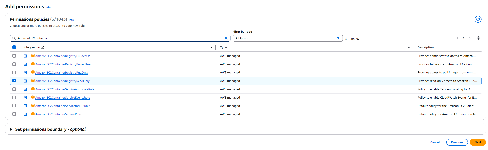
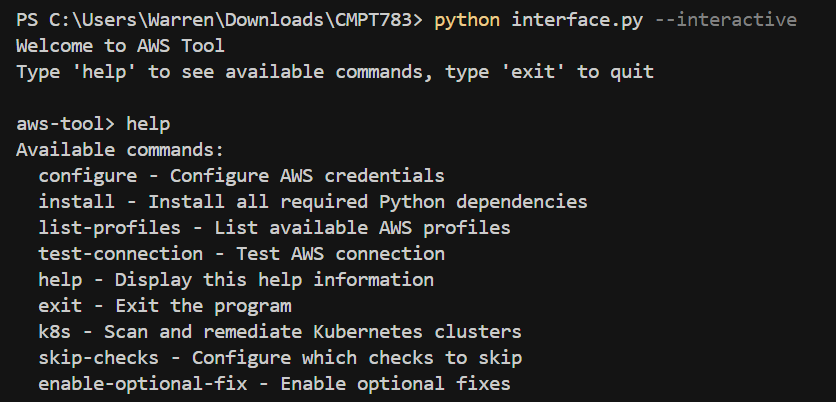

# 🌐 Auto-Remediation-in-AWS-EKS-Based-on-CIS-EKS-Benchmark-V1.6.0

Therefore, the core of this project is how to securely manage and monitor Amazon EKS clusters in large organizations through automated implementation and remediation, consistent with the CIS Amazon EKS Benchmark v1.6.0.

This project focuses on continuous EKS security assessments and automatic remediation of non-compliant configurations. We mainly use the Python programming language, combined with the Kubernetes Python client and AWS SDK to implement the various control requirements in the CIS v1.6.0 benchmark.

```Last updated - 12-23-2024```

# 📚 Catalogs
<details>
<summary>📂 Lists</summary>

## Contents

- 📘 [Introduction](#-1-introduction)
    - [1.1 Background](#11-Background)
    - [1.2 CIS Benchmark and CIS AWS Foundations Benchmark](#12-CIS-Benchmark-and-CIS-AWS-Foundations-Benchmark)
    - [1.3 Existing EKS security check tools](#13-Existing-EKS-security-check-tools)
- 💡 [Framework Design](#-2-framework-design)
    - [2.1 Authentication Part](#21-authentication-part)
    - [2.2 Non-compliant Resource Scan](#22-non-compliant-resource-scan)
    - [2.3 Non-compliant Resource Remediation](#23-non-compliant-resource-remediation)
    - [2.4 Report Part](#24-report-part)
- ⚙️ [Required AWS Serivce](#️-3-required-aws-serivce)
- 🛠️ [Environment Setup](#️-4-environment-setup)
    - [4.1 AWS EKS IAM Role Setup](#41-aws-eks-iam-role-setup)
		- [4.1.1 AWS EKS IAM Role Setup: Cluster Role](#411-aws-eks-iam-role-setup-cluster-role)
    	- [4.1.2 AWS EKS IAM Role Setup: Node Role](#412-aws-eks-iam-role-setup-node-role)
    - [4.2 Use CloudFormation to create EKS network infrastructure](#42-use-cloudFormation-to-create-eks-network-infrastructure)
	- [4.3 EKS Cluster Creation](#43-eks-cluster-creation)
    - [4.4 EKS Node Group Creation](#44-eks-node-group-creation)
- 🟡 [Code Deployment](#-5-Code-Deployment)
	- [5.1 Required Dependency Install](#51-required-dependency-install)
	- [5.2 Initial Tool Configuration](#52-initial-tool-configuration)
	- [5.3 Automatic scanning and report generation](#53-automatic-scanning-and-report-generation)
- 🚑 [Remediation](#-6-remediation)
	- [6.1 CIS control remediations](#61-cis-control-remediations)
		- [6.1.1 CIS Controls need manual remediations](#611-cis-controls-need-manual-remediations)
		- [6.1.2 CIS Controls support automatic remediation](#612-cis-controls-support-automatic-remediation)
- 🧩 [Remediation examples](#-7-remediation-example)
- 🔚 [Conclusion](#-8-Conclusion)

</details>

# 📘 1 Introduction

## 1.1 Background
With the rapid popularization of cloud computing, containerized platforms, especially Amazon EKS, have become the core solution for enterprises to deploy and manage cloud-native applications. With EKS, enterprises can quickly build scalable and reliable Kubernetes clusters in the cloud and support global business needs with greater flexibility.

However, the security of EKS clusters is critical to protecting sensitive data, ensuring business continuity, and meeting compliance requirements. Any improper configuration or abuse of permissions may lead to data leakage, service interruption, and even serious legal and economic consequences. Therefore, strengthening EKS security protection has become an important issue in the field of cloud security.

To meet this challenge, the Center for Internet Security (CIS) has released a security benchmark specifically for Amazon EKS - CIS Amazon EKS Benchmark v1.6.0, providing enterprises with systematic security reinforcement guidance.

As the world's leading cloud service provider, AWS provides the key resources and services required to build and protect EKS clusters. Despite this, there are still considerable challenges in continuously monitoring and repairing EKS security configurations in large organizational environments.

Therefore, the ultimate goal of this project is to use CIS Amazon EKS Benchmark v1.6.0 as a guide to achieve security assessment, continuous monitoring, and non-compliant configuration remediation of Amazon EKS clusters in large organizations through automated means.

## 1.2 CIS Benchmark and CIS AWS Foundations Benchmark
CIS Benchmark is a series of globally recognized security configuration guides developed by the Center for Internet Security (CIS) covering various technology environments, including operating systems, cloud platforms, databases, network devices, and applications. The guidelines help organizations strengthen the protection of their IT systems and mitigate potential risks by providing specific, standardized configuration recommendations.

The CIS AWS Foundations Benchmark is a security configuration benchmark designed by the Center for Internet Security (CIS) specifically for Amazon Web Services (AWS) environments. This set of guidelines provides best practices for AWS accounts and services to help organizations ensure the security and compliance of their cloud resources, including identity and access management (IAM), logging, monitoring, and network configuration. It provides AWS users with more targeted security monitoring and remediation of non-compliant resources.

## 1.3 Existing EKS security check tools
After gaining a deeper understanding of the security risks faced by Amazon EKS, we will now evaluate the performance of current mainstream tools in actual security management and explain how our solution, CloudKubeShield, effectively fills the gaps in existing solutions.

First, GuardDuty, an AWS-hosted threat detection service that continuously monitors EKS audit logs to identify potential malicious behavior. Although GuardDuty performs well in detecting abnormal behavior, it is not designed to implement the CIS Amazon EKS Benchmark v1.6.0 and lacks benchmark compliance checks for cluster configuration items. In addition, GuardDuty does not provide a remediation mechanism and only sends alerts after security incidents occur, lacking pre-emptive protection and automated response capabilities.

Second, kube-bench, one of the most widely used security benchmark checking tools in the Kubernetes ecosystem. It follows the CIS benchmark for scanning, but focuses mainly on local checks of worker nodes, with limited support for control planes and AWS managed services. In addition, kube-bench is not optimized for Amazon EKS and does not support unified management of multiple accounts or across regions. Limited scalability and automation capabilities in multi-cluster, multi-account enterprise environments, and only provides static recommendations without auto-remediation capabilities.

The third tool is Securenetes, which was built in the same course last year. Although it adds auto-remediation capabilities based on kube-bench, the target platform is still a general Kubernetes cluster rather than AWS-managed EKS. Due to the lack of integration with AWS security services, Securenetes cannot effectively detect and remediate EKS-specific resources (such as IAM, CloudTrail, Config).

To this end, we designed and developed CloudKubeShield, a security compliance framework built specifically for Amazon EKS, fully aligned with the CIS Amazon EKS Benchmark v1.6.0. The project covers four major security areas - control plane configuration, worker node security, RBAC policy review, and AWS managed resources - and implements a comprehensive check of all 46 controls.

CloudKubeShield has the following core advantages:

+ Full benchmark coverage: fully implements the control items defined in CIS EKS Benchmark v1.6.0, with no blind spot security assessment.

+ Cross-account support: can centrally scan EKS clusters in multiple AWS accounts within an organization, adapting to the multi-account architecture of large enterprises.

+ Automatic repair mechanism: built-in remediation logic, automatically performs repairs when non-compliant configurations are found, improving response efficiency.


# 💡 2 Framework Design
The framework shown in the figure reflects the overall design concept of the project. The implementation of the entire framework will be divided into four parts:

+ Part 1. Authentication Part
+ Part 2. Non-compliant Resource Scan
+ Part 3. Non-compliant Resource Remediation
+ Part 4. Report Part


## 2.1 Authentication Part
In this part, we use two methods to configure access permissions to the Amazon EKS cluster to support automated security checks and configuration fixes. The core difference between the two methods lies in the granularity and operational capabilities of identity authorization.

Method 1: Create an IAM user and add it to the EKS access control list

+ After creating an IAM user through the AWS console or CLI, you can add the user's ARN to the access control of the target EKS cluster (that is, the Access panel or aws-auth ConfigMap). This method allows users to connect to the cluster with static credentials (Access Key and Secret Key), but usually only grants limited permissions, mainly for cluster metadata access or read-only purposes, and cannot complete actual resource configuration and change operations.

Method 2: Use configuration files + OIDC Token to obtain full permissions

+ In this method, we use the IAM entity (usually a role) that has been added to the aws-auth ConfigMap to generate an OIDC identity token and create a kubeconfig file through aws eks update-kubeconfig. The identity information contained in this configuration file will automatically obtain temporary credentials through STS to establish an authenticated connection with the API Server. As long as the IAM entity has been correctly mapped to the Kubernetes RBAC role, full access to the EKS cluster can be achieved, including pod management, configuration modification, and policy repair operations.
This project uses the second method as the default connection mechanism to ensure that the automatic repair function has sufficient permissions to perform compliance checks and configuration changes on cluster resources.


## 2.2 Non-compliant Resource Scan
In this part, the tool combines the Kubernetes API, kubectl command-line tool, and AWS Systems Manager (SSM) to automate compliance scanning of EKS clusters, covering all controls of CIS Amazon EKS Benchmark v1.6.0.

Kubernetes API and kubectl

+ The tool interacts with the target EKS cluster through the Kubernetes API Server and uses kubectl to automatically execute various inspection instructions to obtain key information such as cluster configuration, node status, RBAC policy, etc. This approach ensures the real-time and accuracy of the inspection and can be adapted to different versions of Kubernetes.

AWS Systems Manager (SSM)

+ When remote command execution or cross-account operations are required, the tool relies on the agentless communication capabilities provided by SSM to securely access the underlying resources or node configuration of the target cluster. SSM is also used to complete in-depth inspections of node-level resources without publicly accessing the cluster access portal.

Structured output and subsequent operations

+ All scan results are output in a structured format for further analysis, report generation, and visualization. At the same time, the results can also be passed as input to the automatic repair module to achieve immediate response and closed-loop management of non-compliance items.


## 2.3 Non-compliant Resource Remediation
In this part, the tool automatically performs remediation operations with the help of Kubernetes API, kubectl and AWS Systems Manager (SSM) to ensure that the cluster remains secure and compliant.

Kubernetes API and kubectl

+ The tool uses kubectl and Kubernetes API to make precise changes to cluster resources, including patch updates (patch configuration), policy enforcement (policy enforcement), and permission configuration adjustments. The remediation logic matches the control items according to the scan results, ensuring that only resources with non-compliant items are modified minimally to avoid side effects.

AWS Systems Manager (SSM)

+ For remediation involving low-level nodes (such as kubelet parameters and system service configuration), the tool executes commands through AWS SSM to remotely modify related settings on EC2 nodes. SSM supports agentless remote execution and has cross-account access capabilities, allowing node-level remediation to be completed safely without exposing SSH channels.


## 2.4 Report Part
In this part, the tool integrates the ReportLab library to generate structured PDF reports that fully display the security status and compliance check results of the EKS cluster.

Structured output

+ The report content is automatically organized based on the results output by the scanning module, covering the inspection status, problem details and remediation suggestions for each CIS control, which is convenient for auditing and compliance tracking.

Visual presentation

+ The report intuitively displays the inspection results of each control item in the form of tables, lists, etc., including the control item number, description, detection conclusion (compliant/non-compliant), and corresponding remediation operation instructions.

Summary and export

+ Each report provides a compliance summary, which supports summarizing the current compliance rate by cluster dimension, helping the security team quickly identify risk points and guide subsequent operations. The report is finally exported to PDF format, which is suitable for archiving, auditing or reporting to management.


# ⚙️ 3 Required AWS Serivce
1. [AWS EKS](https://docs.aws.amazon.com/eks/latest/userguide/what-is-eks.html): A managed Kubernetes service designed to simplify the deployment, management, and scaling of containerized applications using Kubernetes on AWS.

2. [AWS IAM](https://docs.aws.amazon.com/IAM/latest/UserGuide/introduction.html): A service that enables fine-grained access control through centralized management of authentication identities, roles, and resource-level permissions.

3. [AWS SSM](https://docs.aws.amazon.com/systems-manager/latest/userguide/what-is-systems-manager.html): A unified management service that provides secure and automated configuration, patching, and command execution across AWS compute resources.

4. [AWS EC2](https://docs.aws.amazon.com/AWSEC2/latest/UserGuide/concepts.html): A scalable computing service that provides virtual machine instances for hosting applications and workloads in the AWS cloud environment.

# 🛠️ 4 Environment Setup
This section describes how to create the correct environment to use the tool and includes how to reproduce our code flow to a minimal extent.

### **🚨 Note:**
*AWS EKS provides fully automated Kubernetes cluster deployment capabilities. However, during testing, we found that using the automatic deployment option would result in the cluster failing to successfully create and register nodes in most cases. Therefore, we recommend that if you want to reproduce the results of this tool, please carefully follow the steps below to manually create a Kubernetes cluster.*

## 4.1 AWS EKS IAM Role Setup
In this part, we will introduce how to correctly create the IAM Role for AWS EKS cluster step by step.

### 4.1.1 AWS EKS IAM Role Setup: Cluster Role

✅ Step 1: Select the trusted entity type

+ In the first step, select "AWS service" as the trusted entity type, indicating that the IAM role will be called and used by AWS EKS Cluster.

✅ Step 2: Specify the service name (Service or use case)

+ In the service selection box below, enter and select "EKS", which is Amazon Elastic Kubernetes Service.

✅ Step 3: Select a specific use case

+ The system will list multiple use cases related to EKS, and each option corresponds to EKS's access requirements to AWS resources in different scenarios. The selection here is:

+ EKS - Cluster: Allows the cluster control plane to manage AWS resources on behalf of users (such as creating ENI, mounting volumes, accessing IAM, etc.). This is the role used by the cluster control plane to access the AWS API. This option is usually used to create the IAM role required by the EKS control plane, which has cluster-level resource operation permissions.

+ Click "Next" to continue configuring the permission policy
After completing the selection of the trusted entity and use case, click the "Next" button in the lower right corner of the page to enter the permission policy binding step and assign appropriate permissions to the role.


✅ Step 4: Add Permissions

+ In this step, the system automatically attaches the AmazonEKSClusterPolicy policy. This managed policy grants the control plane the permissions to manage AWS resources such as VPC network interfaces, log services, and IAM, ensuring that the EKS cluster can be scheduled and run normally.

+ "Set permissions boundary" is optional and can be skipped if there is no special requirement. Click "Next" in the lower right corner to proceed to the next step.

✅ Step 5: Name, review, and create

+ Role name: It is recommended to name it eks-cluster-role for easy identification and reference later.

+ Description: Briefly describe the purpose of the role, such as "Allows the cluster Kubernetes control plane to manage AWS resources on your behalf."

+ Trust policy: The system has preset a trust policy that allows the service principal eks.amazonaws.com to perform the sts:AssumeRole operation, which allows the EKS control plane to call AWS resources as this role:

```json
{
	"Version": "2012-10-17",
	"Statement": [
		{
			"Effect": "Allow",
			"Principal": {
				"Service": "eks.amazonaws.com"
			},
			"Action": "sts:AssumeRole"
		}
	]
}
```


### 4.1.2 AWS EKS IAM Role Setup: Node Role

✅ Step 1: Select the trusted entity type

+ In the first step, select "AWS service" as the trusted entity type, indicating that the IAM role will be called and used by AWS EKS Cluster.

✅ Step 2: Specify the service name (Service or use case)

+ In the service selection box below, enter and select "EC2", which is Amazon EC2 Service.

✅ Step 3: Select a specific use case

+ The system will list multiple use cases related to EC2, and each option corresponds to different scenarios where EC2 instances need to access AWS services. The selection here is:

+ EC2: Allows EC2 instances to call AWS services on behalf of the user. This is the most commonly used use case for assigning IAM roles to EC2 instances, enabling them to access services such as S3, CloudWatch, or Systems Manager securely and directly without embedding static credentials.

+ Click "Next" to continue configuring the permission policy.
After completing the selection of the trusted entity and use case, click the "Next" button in the lower right corner of the page to proceed to the permissions configuration step, where appropriate policies will be attached to define what actions the EC2 instance can perform.


✅ Step 4: Add Permissions

+ In this step, multiple AWS managed policies are selected and attached to the role to grant EC2 instances the required runtime permissions in an EKS environment. The selected policies are:

	+ AmazonEKS_CNI_Policy: Grants permissions required by the Amazon VPC CNI plugin to manage networking for pods within the cluster.

	+ AmazonEKSWorkerNodePolicy: Grants worker nodes permission to connect and register with the EKS control plane.

	+ AmazonEC2ContainerRegistryReadOnly: Grants read-only access to Amazon ECR, allowing nodes to pull container images from private registries.

	+ AmazonSSMManagedInstanceCore: Allows EC2 instances to be remotely managed and operated through AWS Systems Manager (such as SSM Agent).

+ These policies ensure that EC2 worker nodes can communicate with the control plane, handle container networking, and retrieve container images securely from Amazon ECR.

+ "Set permissions boundary" is optional and can be skipped if not required. Click “Next” in the lower right corner to proceed to the final step of the role creation process.

✅ Step 5: Name, review, and create

+ Role name: It is recommended to name it eks-node-group-role for easy identification and reference later.

+ Description: Briefly describe the purpose of the role, such as “Allows the cluster Kubernetes control plane to manage AWS resources on your behalf.”

Trust policy: The system has preset a trust policy that allows the service principal ec2.amazonaws.com to perform the sts:AssumeRole operation, which authorizes EC2 instances to assume this role and interact with AWS services:

```json
{
	"Version": "2012-10-17",
	"Statement": [
		{
			"Effect": "Allow",
			"Principal": {
				"Service": "ec2.amazonaws.com"
			},
			"Action": "sts:AssumeRole"
		}
	]
}
```




## 4.2 Use CloudFormation to create EKS network infrastructure

In this part, we will introduce how to deploy a VPC network environment that meets the requirements, including subnets, routing tables, NAT gateways and other resources for EKS. AWS officially provides predefined CloudFormation templates for quickly building this network structure.

✅ Step 1: Select the template source

+ 📍Page title: Create stack → Prepare template

+ In the "Prepare template" area, select Choose an existing template to use an existing CloudFormation template.

+ In the "Specify template" area, select Amazon S3 URL as the template source.

+ Fill in the AWS official template address in the input box:

	+ https://s3.us-west-2.amazonaws.com/amazon-eks/cloudformation/2020-10-29/amazon-eks-vpc-private-subnets.yaml

+ This is a standard template provided by AWS for creating a private subnet VPC, which is suitable for the network configuration of the EKS cluster.

The purpose of this step: load a predefined basic network structure template, including VPC, private/public subnets, NAT gateways, routing tables and other resources.


✅ Step 2: Specify stack name and network parameters

+ 📍Page title: Specify stack details

+ Stack name: Fill in the stack name, such as eks-vpc-test. This name will be used to identify and manage the resources created by CloudFormation later.

+ Parameter configuration (Worker Network Configuration):

	+ VpcBlock: Set the CIDR range of the entire VPC (the default value is usually acceptable).

	+ PublicSubnet01Block, PublicSubnet02Block: Set two public subnet CIDRs.

	+ PrivateSubnet01Block, PrivateSubnet02Block: Set two private subnet CIDRs.

The purpose of this step: Provide the necessary user input parameters for the CloudFormation template, especially the network configuration, to determine the subnet division and availability zone coverage.


✅ Step 3: Advanced settings (optional)

+ 📍Page title: Configure stack options

+ Tags (optional): You can add resource tags to classify resources, which can generally be skipped.

+ IAM Role (optional): If there is no special need, keep it blank and CloudFormation will run with default permissions.

+ Stack failure options:

	+ By default, Roll back all stack resources is selected to ensure that all resources are rolled back and the status is consistent when creation fails.

+ Other advanced options (such as Notification, Stack policy, Rollback alarm) can be kept as default and not changed.

The purpose of this step: Provide additional resource control and failure recovery policy configuration, but for standard deployment scenarios, all default values ​​can be used.


After completing the above configuration, click "Next", enter the final preview page to confirm that all configurations are correct, and then click "Create stack" to start resource deployment.


✅ Result:
After the deployment is complete, CloudFormation will automatically create a stack containing:

	1 VPC

	2 public subnets

	2 private subnets

	1 NAT gateway

	Dependency resources such as routing tables, Internet Gateway, EIP, etc.

This network architecture is the basic environment for the subsequent deployment of the EKS cluster, meeting the requirements of high availability, partition isolation, and public/private network communication.


## 4.3 EKS Cluster Creation

✅ Step 1: Select a configuration mode

+ 📍Page area: Configure cluster

+ Select Custom configuration (not selected by default) in "Configuration options" to manually control the detailed configuration of the cluster's network, identity, version, etc.

+ ❗Do not select "Quick configuration", which uses EKS Auto Mode to create managed resources, which may cause nodes to fail to register.

✅ Step 2: Disable EKS Auto Mode

+ Make sure the "Use EKS Auto Mode" option is off (the toggle is gray). Although this mode simplifies node automatic expansion and resource management, it limits permission control and node scheduling capabilities in custom deployments.

+ Step 3: Configure basic cluster information
Name: Enter a cluster name, such as Test-cluster. This name cannot be changed after creation.

+ Cluster IAM role: Select the previously manually created IAM role (such as eks-cluster-test) from the drop-down menu. The role should have AmazonEKSClusterPolicy permissions and trust the principal as eks.amazonaws.com.

✅ Step 4: Kubernetes version settings
+ 📍Page area: Kubernetes version settings

+ Kubernetes version: Select the currently supported version (such as 1.32).

+ Upgrade policy: Keep the default option Standard, which means you will enjoy a 14-month standard version support period at no additional cost.

✅ Step 5: Skip Auto Mode Compute configuration
+ 📍Page area: Auto Mode Compute

+ This area displays a prompt: If you are not using EKS Auto Mode, configure the node group after the cluster is created. In this process, you will manually add the node group, so you don't need to change anything.

✅ Step 6: Access control configuration
+ 📍Page area: Cluster access

+ Bootstrap cluster administrator access: It is recommended to select Allow cluster administrator access to ensure that the current creator has administrator permissions and can access all Kubernetes control resources during the cluster initialization phase.

+ Cluster authentication mode: Keep the default setting of EKS API, which means using IAM entities for authentication, which is limited to the authorization method controlled by AWS EKS API.


✅ Step 7: Specify networking
+ 📍Page area: Specify networking

+ VPC: Select the dedicated VPC created previously through CloudFormation (such as eks-vpc-test-VPC).

+ Subnets: Select 4 subnets, including the following:

	+ 2 private subnets (for worker node communication)

	+ 2 public subnets (for control plane and NAT gateway connection)

+ Additional security groups: Can be left blank, EKS will automatically create the necessary control plane security groups.

+ Choose cluster IP address family: Keep the default IPv4.

+ Cluster endpoint access: It is recommended to select Public and private to allow control plane access from inside and outside the VPC, while ensuring that worker node access is always within the private network.

✅ The purpose of this step is to specify the deployment network environment of the control plane ENI and node group ENI, and determine the access scope exposed by the API server.

✅ Instructions for subsequent steps:
Subsequent pages such as Logging, Add-ons, Tags, and Review can all maintain the system default configuration without any changes.

Finally, click Create to start the cluster creation process.


✅ Step 8: EKS add IAM Access Entry operation process
+ 📍Page area: Access

+ Enter the EKS console, click the target cluster and switch to the Access page.

+ Click the "Create access entry" button

+ Fill in the IAM principal ARN

	+ Select the IAM identity (such as user or role) to which you want to grant permissions, for example:
	```text
		arn:aws:iam::307946637372:user/Admin
	```
+ Select Type as "Standard"

	+ The Standard type is used to manually manage permissions.

+ Click "Next" to enter the Access Policy configuration page

+ Add Access Policy
	+ Select and add the appropriate access policy.
	```text
		AmazonEKSAdminPolicy
		AmazonEKSClusterAdminPolicy
	```

+ Select Cluster as the access scope, which means it applies to the entire cluster, not a specific namespace.

+ Click “Next” → Review and confirm “Create”.

After this, the IAM identity (such as the Admin user) has the authority to access and manage the EKS cluster.


## 4.4 EKS Node Group Creation
✅ Step 1: Configure basic information of the node group

+ 📍Page area: Node group configuration

+ Name: Enter the node group name, such as test. The name cannot be changed after creation.

+ Node IAM role: Select the custom IAM role created previously (such as eks-node-test), which needs to have the following policy attached:

	+ AmazonEKSWorkerNodePolicy

	+ AmazonEKS_CNI_Policy

	+ AmazonEC2ContainerRegistryReadOnly

+ Remaining configuration items (such as labels, taints, templates, etc.) retain the default settings and do not need to be modified.

✅ Step 2: Configure node computing resources
+ 📍Page area: Set compute and scaling configuration

+ AMI type: Select the default value Amazon Linux 2 (AL2_x86_64), which means using the official optimized Amazon EKS image.

+ Capacity type: Keep the default value On-Demand.

+ Instance types: Fill in t2.medium or other required specifications. (For testing we recommand t2.medium is the minimum one to choose.)

+ Disk size: 20 GiB by default, which can be modified if needed.

+ Scaling configuration:

	+ Desired size: 2

	+ Minimum size: 2

	+ Maximum size: 2

+ ✅ This configuration indicates the initial deployment of 2 nodes and limits the automatic scaling range to a fixed 2.

✅ Step 3: Configure node network

+ 📍Page area: Specify networking

+ Subnets: Select 4 subnets in the deployment VPC (including two public and two private) to ensure that nodes can be deployed and expanded across availability zones.

+ Keep Configure remote access to nodes turned off (default), and there is no need to enable SSH login for nodes.

✅ Step 4: Subsequent settings and confirmation
+ The remaining Add-ons, Metadata and other steps can retain the default settings.

+ Click "Next" and finally "Create" to start node group creation.

✅ Final effect verification
After the creation is complete, you should be able to see the two EC2 instances under the node group in the Ready state on the Compute page, indicating that the nodes have successfully joined the cluster and can be used to schedule Pods.


# 🟡 5 Code Deployment
In this part, we will introduce how to deploy our code step by step.

## 5.1 Required Dependency Install
✅ Step 1: Install project dependencies (requirements.txt)
+ 📌 1. Make sure you have created a virtual environment (optional but recommended)

```bash
	python3 -m venv venv
	source venv/bin/activate # Linux/macOS
	venv\Scripts\activate # Windows
```

+ 📌 2. Install dependencies in requirements.txt
```bash
	pip install -r requirements.txt
```
+ 📄 requirements.txt content is as follows:

	+ boto3
	+ kubernetes
	+ reportlab
	+ requests

+ 📌 3. Check if the installation is successful (optional)
```bash
	pip list
```

+ Confirm that the above four libraries are listed.

✅ Step 2: Install AWS CLI v2

+ 🍎 macOS

	+ Download and install

	```bash
		curl "https://awscli.amazonaws.com/AWSCLIV2.pkg" -o "AWSCLIV2.pkg"
		sudo installer -pkg AWSCLIV2.pkg -target /
	```
	+ Verify installation
	```bash
		aws --version
	```
	+ The output should be similar to:
	```text
		aws-cli/2.x.x Python/3.x.x ...
	```
+ 🪟 Windows

	+ Download the MSI installer
	```text
		https://awscli.amazonaws.com/AWSCLIV2.msi
	```

	+ Double-click to run the installation
	
		+ Follow the prompts to complete the installation.

	
	+ Verify the installation (in Command Prompt or PowerShell)
	```bash
		aws --version
	```
	+ The output should be similar to:
	```text
		aws-cli/2.x.x Python/3.x.x Windows/10 exe/AMD64
	```

## 5.2 Startup and basic configuration process

✅ Step 1: Start the tool and view the command list

+ python interface.py --interactive

+ After entering the interactive mode, enter help to view supported commands:

+ Available commands:
	- configure ➤ Configure AWS credentials
	- install ➤ Install required dependencies
	- list-profiles ➤ List configured AWS CLI Profiles
	- test-connection ➤ Test whether the current AWS credentials are effective
	- k8s ➤ Scan and repair EKS clusters



✅ Step 2: Configure AWS credentials

```bash
	aws-tool> configure
```
You can enter a custom profile name or leave it blank to use the default. When entering Access Key/Secret, please use an IAM user (such as Admin user) who has joined the EKS cluster permissions so that you can call Kubernetes resources later:

```bash
	AWS Access Key ID ➤ Get from IAM user
	AWS Secret Access Key ➤ Get from IAM user
	Region name ➤ As us-east-1
	Output format ➤ json is recommended
```
✅ After successful configuration, the credentials will be saved in ~/.aws/credentials.


✅ Step 3: List all available profiles

```bash
	aws-tool> list-profiles
```

Output example:


✅ Step 4: Test whether the connection is successful

```bash
	aws-tool> test-connection
```

If the connection is successful, the current account and IAM user information will be returned, for example:


## 5.3 Automatic scanning and report generation

🚀 One-click command

```bash
	python interface.py --auto
```

📋 Function description:

+ This command will automatically perform the following operations:

+ 🔐 Load local AWS credentials and all available AWS CLI Profiles (multi-account support)

+ 🌐 Traverse EKS clusters in all accounts

+ 🔍 Perform security checks based on CIS EKS Benchmark v1.6.0

+ 🛠️ Automatically perform repairs on some non-compliant configurations (if enabled)

+ 📄 Use reportlab to generate a structured report in PDF format, including the following for each cluster:

	+ Check item status (compliant/non-compliant)

	+ Description and explanation

	+ Repair suggestions and results

🧠 Review before use:

+ ✔️ Install dependencies (pip install -r requirements.txt)

+ ✔️ Configure AWS CLI credentials (aws configure or configure in the tool)

+ ✔️ Ensure that the IAM user has joined the target cluster aws-auth

+ ✔️ All clusters are within the access permissions of the CLI profile

✅ After successful operation, a report_*.pdf file will be generated in the current directory, such as:

		report_test-cluster_2025-04-13.pdf


The tool supports fully automated scanning and report generation processes through the command line parameter --auto. This command can be run manually in an interactive terminal or integrated into a Bash script to achieve timed triggering with a task scheduler (such as cron or systemd timer).

In this way, users can achieve continuous security assessment and compliance report generation for all EKS clusters in multiple AWS accounts, which is suitable for automated operation and maintenance scenarios and long-term monitoring systems.


# 🚑 6 Remediation

In this part, we will introduce the remediation details from CIS EKS Benchmark.

## 6.1 CIS control remediations

The functions in remediation.py form the key component of the automated remediation process.

This project is built based on the CIS EKS Benchmark v1.6.0, which comprises a total of 46 controls. These controls are categorized as follows:

1. Control Plane (2 Controls)
2. Worker Nodes (13 Controls)
3. Policies (19 Controls)
4. Managed Services (12 Controls)

List of CIS controls supported by the tool and comparison of each CIS AWS Foundations Benchmark version:
[CIS AWS Foundations Benchmark](https://www.cisecurity.org/benchmark/kubernetes)

## 6.1.1 CIS Controls need manual remediations

The following controls need require manual actions from users to complete the remediation process. In case of these controls, our functions will always mark these findings as non-compliant and provide remediation suggestions:

| CIS control ID  |  Control Description |  Actions Required from Users | 
|------------------|------------------|------------------|
|2.1.2|Ensure audit logs are collected and managed|Enable the audit log in each working node|
|4.1.2|Ensure that access to Kubernetes secrets is restricted|Check and remove get, list and watch access to secret objects in the cluster|
|4.1.3|Minimize wildcard use in Roles and ClusterRoles|replace wildcard (*) permissions with specific apiGroups, resources, and verbs in Roles and ClusterRoles. Review each role with wildcard permissions and limit them to only what is necessary for the application or user|
|4.1.4|Minimize access to create pods|Check and remove create access to pod objects in the cluster|
|4.1.6|Ensure that Service Account Tokens are only mounted where necessary|Regularly review pod and service account objects in the cluster to ensure that the automountServiceAccountToken setting is false for pods and accounts that do not explicitly require API server access|
|4.1.7|Cluster Access Manager API to streamline and enhance the management of access controls within EKS clusters|if the EKS cluster has already been created using ConfigMap, you will need to rebuild the cluster and choose EKS API for authentication|
|4.1.8|Limit use of the Bind, Impersonate and Escalate permissions in the Kubernetes cluster|Check and remove the impersonate, bind and escalate rights from subjects|
|4.4.1|Prefer using secrets as files over secrets as environment variables|Avoid using secrets via environment variables; mount them as files instead|
|4.4.2|Consider external secret storage|Enable the audit log in each working node|
|4.5.1|Create administrative boundaries between resources using namespaces|Create separate namespaces for workloads to avoid using the default namespace|
|5.1.2|Minimize user access to Amazon ECR |Restrict ECR write/delete permissions from IAM users; avoid full-access policies|
|5.1.3|Minimize cluster access to read-only for Amazon ECR|Grant only read-only ECR access to EKS control plane and node IAM roles|
|5.1.4|Minimize Container Registries to only those approved|Use container images only from trusted registries|
|5.3.1|Ensure Kubernetes Secrets are encrypted using Customer Master Keys (CMKs) managed in AWS KMS|Enable secrets encryption using a customer-managed KMS key during cluster creation|
|5.4.5|Encrypt traffic to HTTPS load balancers with TLS certificates|Configure HTTPS listeners with valid TLS certificates for exposed services|
|5.5.1|Manage Kubernetes RBAC users with AWS IAM Authenticator for Kubernetes or Upgrade to AWS CLI v1.16.156 or greater|Manage all Kubernetes RBAC identities through the AWS IAM Authenticator|

>Links to the AWS documentation have been provided, where you can find more detailed information about the controls.

## 6.1.2 CIS Controls support automatic remediation
| CIS control ID  |  Control Description |  Actions Required from Users | 
|------------------|------------------|------------------|
|2.1.1|Check if audit logs are enabled for an Amazon EKS cluster|Enable all required cluster logging types including API, audit, authenticator, controllerManager, and scheduler|
|3.1.1|Check if kubeconfig file permissions are set to 644 or more restrictive|Use chmod to set kubeconfig file permissions to 644 or more restrictive|
|3.1.2|Check if kubelet kubeconfig file ownership is set to root|Use chown to set kubelet kubeconfig file ownership to root|
|3.1.3|Check if kubelet kubeconfig file permissions are set to 644 or more restrictive|Use chmod to set kubelet kubeconfig file permissions to 644 or more restrictive|
|3.1.4|Check if kubelet config file permissions are set to 644 or more restrictive|Use chown to set kubelet config file ownership to root|
|3.2.1|Check if Anonymous Auth is disabled|Set authentication.anonymous.enabled=false in kubelet configuration|
|3.2.2|Check if authorization-mode argument is not set to AlwaysAllow|Set authentication.webhook.enabled=true and authorization.mode="Webhook" in kubelet configuration|
|3.2.3|Check if a Client CA File is configured|Set the correct authentication.x509.clientCAFile path in kubelet configuration|
|3.2.4|Check if read-only-port is disabled|Set readOnlyPort=0 in kubelet configuration|
|3.2.5|Check if streaming-connection-idle-timeout argument is not set to 0|Set streamingConnectionIdleTimeout to a non-zero value in kubelet configuration|
|3.2.6|Check if make-iptables-util-chains argument is set to true|Set makeIPTablesUtilChains=true in kubelet configuration|
|3.2.7|Check if eventRecordQPS argument is set to 0 or an appropriate level|Set eventRecordQPS to an appropriate value like 5 in kubelet configuration|
|3.2.8|Check if rotate-certificates argument is not present or set to true|Set RotateCertificates=true in kubelet configuration|
|3.2.9|Check if RotateKubeletServerCertificate feature gate is enabled|Set featureGates.RotateKubeletServerCertificate=true in kubelet configuration|
|4.1.1|Check if cluster-admin role is only used where required|Remove unnecessary cluster-admin bindings and use only when absolutely necessary|
|4.1.5|Check if default service accounts are not actively used|Set automountServiceAccountToken=false for default service accounts in all namespaces|
|4.2.1|Check for privileged containers admission|Apply Pod Security Policies to restrict privileged containers|
|4.2.2|Check for containers sharing host process ID namespace|Apply Pod Security Policies to restrict containers with hostPID=true|
|4.2.3|Check for containers sharing host IPC namespace|Apply Pod Security Policies to restrict containers with hostIPC=true|
|4.2.4|Check for containers sharing host network namespace|Apply Pod Security Policies to restrict containers with hostNetwork=true|
|4.2.5|Check for containers with allowPrivilegeEscalation|Apply Pod Security Policies to restrict containers with allowPrivilegeEscalation=true|
|4.3.1|Check if CNI plugin supports network policies|Use a CNI plugin that supports NetworkPolicy like Calico, Weave, or VPC-CNI|
|4.3.2|Check if all namespaces have Network Policies defined|Create default deny NetworkPolicy for each namespace|
|4.5.2|Check if default namespace is not used|Move resources from default namespace to dedicated namespaces|
|5.1.1|Check if image vulnerability scanning using Amazon ECR is enabled|Enable image scanning for all ECR repositories|
|5.4.1|Check if access to control plane endpoint is restricted|Enable private endpoint access and disable public access|
|5.4.2|Check if clusters are created with Private Endpoint Enabled and Public Access Disabled|Configure cluster with private endpoint access and disable public access|
|5.4.3|Check if clusters are created with Private Nodes|Configure cluster with private nodes and properly restrict public access CIDRs|
|5.4.4|Check if Network Policy is enabled and set appropriately|Update VPC-CNI plugin configuration to enable network policy|

The following controls are fully can be automatically remediated after scan finished. 


>Links to the AWS documentation have been provided, where you can find more detailed information about the controls. 

# 🧩 7 Remediation example
🔹 CIS 2.1.1 - EKS audit log is not enabled
+ Test objective: Confirm that no audit log type is enabled when creating a cluster.

+ Steps:
	
	+ Log in to the AWS Management Console and navigate to EKS → Clusters → Target cluster name → Observability.

	+ Scroll down to the Control plane logs section and click Manage logging in the upper right corner.

	+ Check to see if all log types are off (grey).

	+ If all are off, then this item is considered non-compliant.

	

	

+ Expected result: Cluster clusterLogging field is empty, not meeting the benchmark requirements.

🔹 CIS 3.1.1 - kubeconfig permissions are greater than 644
+ Test objective: Verify that /etc/kubernetes/kubelet/kubeconfig permissions are improperly set.

+ Steps:

	+ Connect to the EC2 under the cluster then run the following command:

	```bash
		chmod 666 /etc/kubernetes/kubelet/kubelet-config.json
	```
+ Expected result: File permissions are 666, not read-write (644 or less), marked as non-compliant.

🔹 CIS 3.1.2 - kubeconfig file is not owned by root
+ Test objective: Verify that kubeconfig file owner is not root:root.

+ Steps:

	+ Connect to the EC2 under the cluster then run the following command:

	```bash
		chown ec2-user:ec2-user /etc/kubernetes/kubelet/kubelet-config.json
	```

+ Expected result: File owner is not root, group is not root, not meeting the benchmark requirements.

🔹 CIS 3.2.1 - Enabled Anonymous Auth
+ Test objective: Check if anonymous access is allowed in kubelet configuration.

+ Steps:

	+ Connect to the EC2 under the cluster then run the following command:

	```bash
		sudo vi /etc/kubernetes/kubelet/kubelet-config.json
	```
	 
	+ Edit:

	```text
		authentication:
			anonymous:
				enabled: true
	```

	+ Then run the following command:
	```bash
		sudo systemctl restart kubelet
	```

+ Expected result: Enable anonymous.enabled: true, which violates the baseline recommendation.

🔹 CIS 3.2.2 - authorization-mode is set to AlwaysAllow
+ Test objective: Confirm that kubelet authorization mode does not use RBAC or Webhook.

+ Steps:

	+ Connect to the EC2 under the cluster then run the following command:

	```bash
		sudo vi /etc/kubernetes/kubelet/kubelet-config.json
	```
	 
	+ Edit:

	```text
		authorization
    		mode: AlwaysAllow
	```

	+ Then run the following command:
	```bash
		sudo systemctl restart kubelet
	```

+ Expected result: Set to AlwaysAllow, skip permission control, which is a high-risk configuration.

🔹 CIS 3.2.4 - Read-only port is enabled
+ Test objective: Confirm that readOnlyPort is not disabled.

+ Steps:

	+ Connect to the EC2 under the cluster then run the following command:

	```bash
		sudo vi /etc/kubernetes/kubelet/kubelet-config.json
	```
	 
	+ Edit:

	```text
		readOnlyPort: 10255
	```

	+ Then run the following command:
	```bash
		sudo systemctl restart kubelet
	```

+ Expected result: Read-only port is exposed on the host, which may leak sensitive state information.

🔹 CIS 3.2.7 - eventRecordQPS setting is unreasonable
+ Test objective: Verify whether the event record rate setting is reasonable.

+ Steps:

	+ Connect to the EC2 under the cluster then run the following command:

	```bash
		sudo vi /etc/kubernetes/kubelet/kubelet-config.json
	```
	 
	+ Edit:

	```text
		eventRecordQPS: -1
	```

	+ Then run the following command:
	```bash
		sudo systemctl restart kubelet
	```

+ Expected result: Negative value means unlimited speed, which may cause log flooding and violate best practices.

Click the image below to jump to our demo video on Youtube.

[](https://youtu.be/xlhhdjzOTjE)


# 🔚 8 Conclusion

This project focuses on the automation of security compliance of Amazon EKS clusters, with four key highlights:

Automated Scanning and Remediation
+ We developed automated tools using Python to implement EKS compliance checks based on the CIS (Center for Internet Security) standard. These checks can be triggered with minimal user input, reducing the need for manual operations and improving efficiency and consistency.

Insightful Reporting
+ The system is integrated with AWS Config to continuously monitor resource configurations to ensure that they comply with CIS benchmarks. This continuous monitoring enables teams to keep abreast of compliance status and quickly identify and resolve potential security issues.

Customizable Checks
+ Our solution is designed with a flexible interface that allows users to select CIS rules to scan, skip irrelevant checks, or enable automatic remediation based on specific needs. This flexibility is achieved through command line interface prompts and configuration files, making the tool more adaptable to different environment needs.

Future Improvement Direction
+ We recognize that automatic remediation may affect the challenges of intentional configuration, so we plan to introduce a whitelist feature to increase the flexibility and security of the automation process. This will allow users to explicitly specify which configurations should be excluded from automatic remediation to prevent accidental changes to critical settings.

This project represents an important step in cloud security automation, significantly improving the efficiency of managing the security posture of EKS environments by reducing manual workloads and enhancing compliance monitoring.
